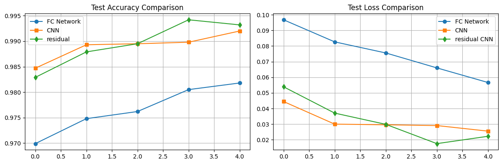

## Задание 1: Сравнение CNN и полносвязных сетей
Сделал 3 модели(полносвязная сеть, простая CNN, CNN с Residual Block) и тренировал их на датасете MNIST
получил такие метрики: 
<ul>
<li>FC-Model max accuracy: 0.9806
<li>Simple CNN max accuracy: 0.992
<li>Residual CNN max accuracy: 0.9924
</ul>

---
График точности и функции потерь для всех моделей:

---

Очень много времени заняло обучение модели CNN с Residual Block (14.5 минут), по итогу она на чуть-чуть лучше чем простая CNN, которая обучалась 3 минуты.

Возможно simple CNN показала бы большую точность при увеличение эпох (она не переобучалась, в отличие от Residual CNN)

Residual CNN и simple CNN имели на протяжение всех эпох точность намного больше чем FC-Model

Самая точная модель - Residual CNN имеет max accuracy: 0.9924 на 3 эпохе

<ul>
<li>FC-Model обучалась 1 минуту и 31 секунд
<li>Simple CNN обучалась 4 минуты и 50 секунды
<li>Residual CNN обучалась 15 минут и 3 секунд
</ul>

<ul>
<li>FC-Model max accuracy: 0.4918
<li>Simple CNN max accuracy: 0.7614
<li>Residual CNN max accuracy: 0.8210
</ul>

Создал еще 3 такие же модели(при этом для полносвязной сети уменьшил нейронные сети с [512, 256, 128] до [128, 64, 32], чтобы количество параметров было сопоставимо с другими моделями)

Стоит отметить, что все модели не переобучивались и могут иметь еще большую точность при увеличении эпох. 

Полносвязная сеть показала очень плохой результат, Residual CNN демонстрирует самую большую точность, Simple CNN имеет точность чуть ниже, чем Residual CNN.

Residual CNN опять обучаеться слишком долго (15 минут и 3 секунд), более чем на 10 минут больше ем Simple CNN 4 минуты и 50 секунды
---
График точности и функции потерь для всех моделей:

---
