## Задание 1: Стандартные аугментации torchvision (15 баллов)

Создал пайплайн стандартных аугментаций torchvision. Примеры получившихся изображений:

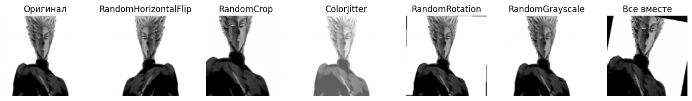

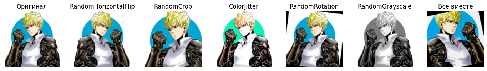

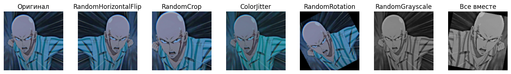

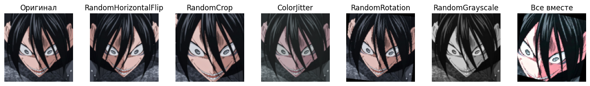

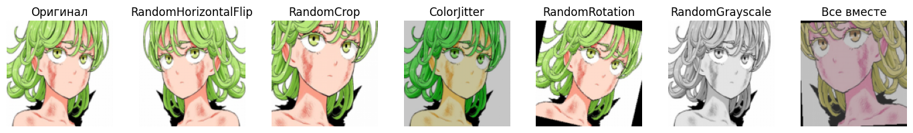

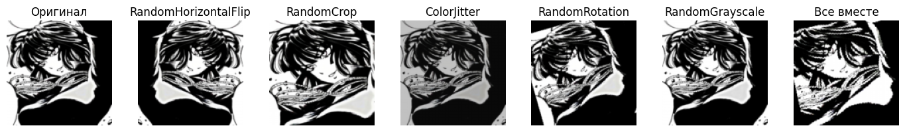

---

## Задание 2: Кастомные аугментации (20 баллов)

Сделал 3 кастомные аугментации: RandomBlur(Случайное размытие изображения), 
RandomPerspective(Случайная перспективная трансформация), RandomBrightnessContrast(Случайное размытие изображения)

Получившиеся изображения:

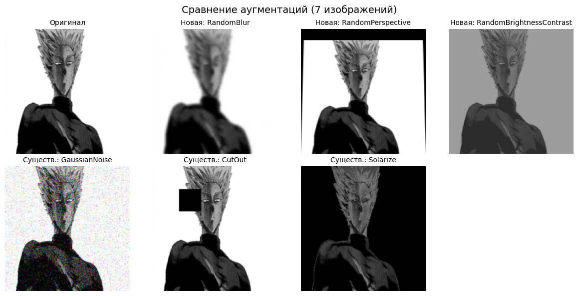

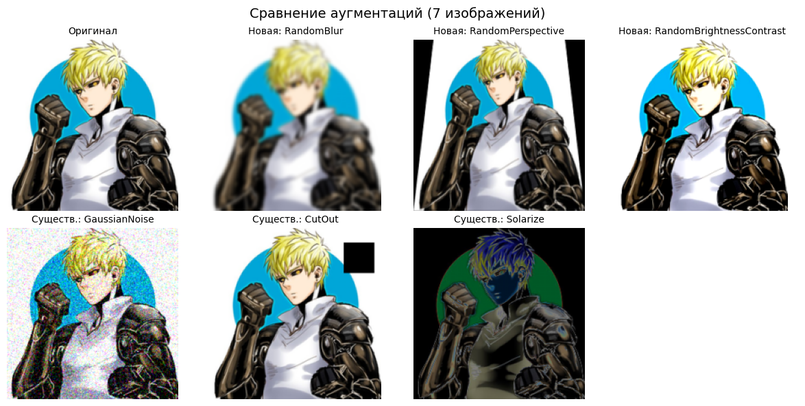

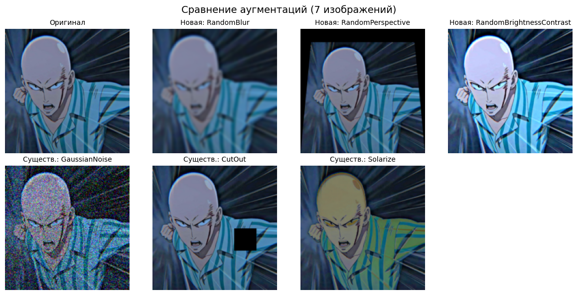

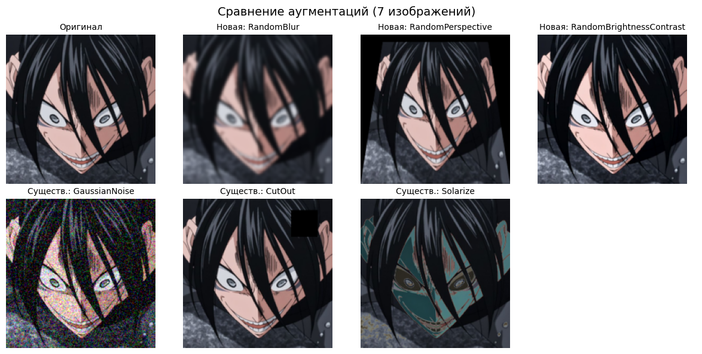

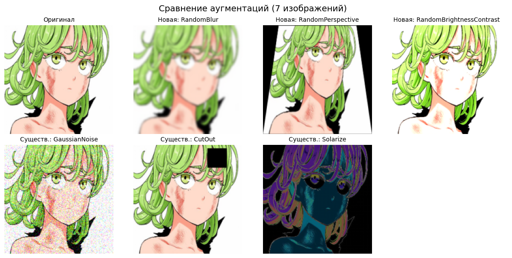

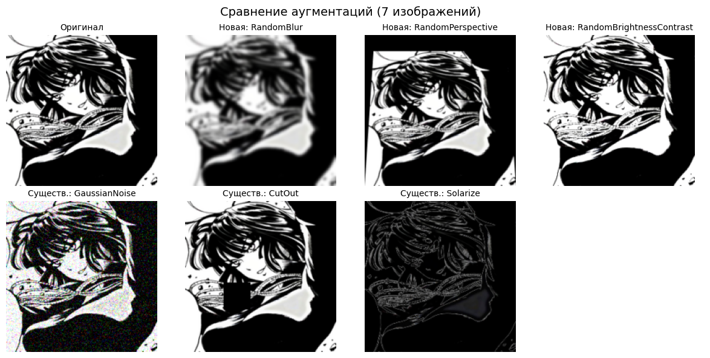

---

## Задание 3: Анализ датасета (10 баллов)

===== Статистика датасета =====
Всего классов: 6
Всего изображений: 180

Размеры изображений:
  Ширина: min=210, max=736, mean=538.9, median=564.0
  Высота: min=240, max=1308, mean=623.6, median=564.0
  Площадь: min=50400, max=962688, mean=344670.9, median=318096.0

Во всех классах по 30 изображений

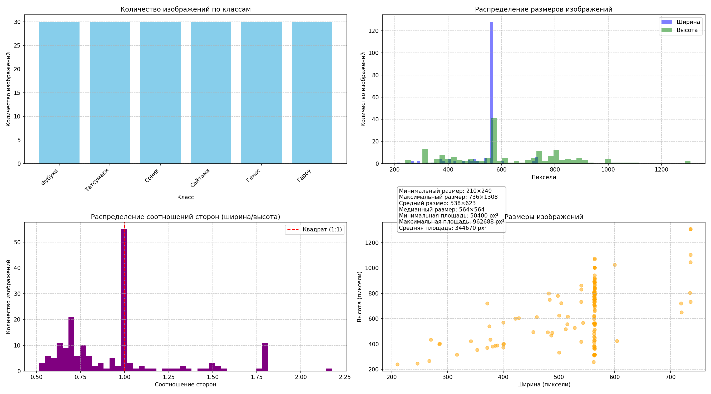

---

## Задание 4: Pipeline аугментаций (20 баллов)

Сделал класс AugmentationPipeline с методами add_augmentation(name, aug), remove_augmentation(name), apply(image), get_augmentations().

Сделал 3 конфигурации (light, medium, heavy) и применил их. Результаты можео посмотреть в папке ./augmented_results

---

## Задание 5: Эксперимент с размерами (10 баллов)

=== Результаты эксперимента ===
Размер     | Загрузка (с) | Аугментация (с) | Память (МБ) 
-------------------------------------------------------
64         | 0.6159       | 0.2227         | 0.15        
128        | 0.7559       | 0.3075         | 0.15        
224        | 1.0227       | 0.5610         | 0.30        
512        | 1.3167       | 1.9183         | 1.51        

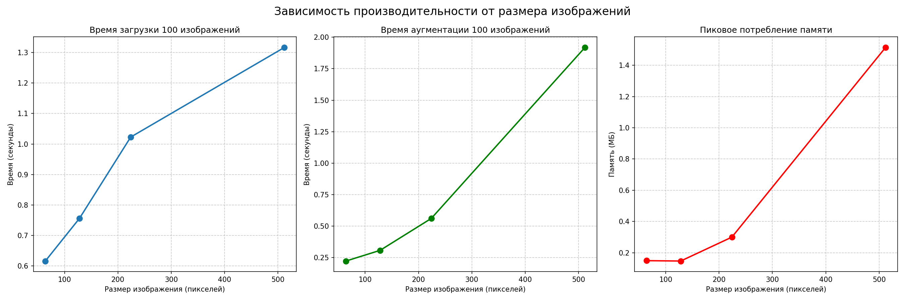
---

## Задание 6: Дообучение предобученных моделей (25 баллов)

Взял модель resnet18. Модель странно повела себя на первой эпохе: показатели на валидационной выборке быстро скатились с 0.6600 до 0.3383, однако затем вернулись до 0.6750 и стали расти вяыыше.
Наибольшая точность: 0.7383

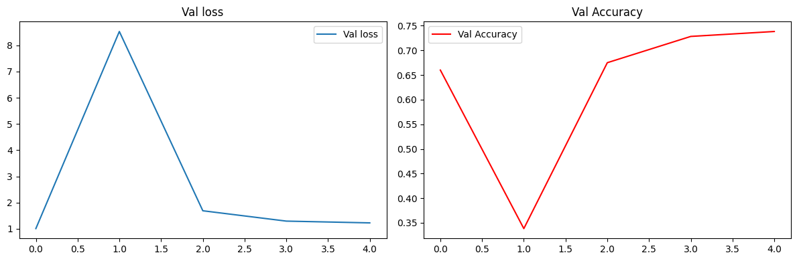
