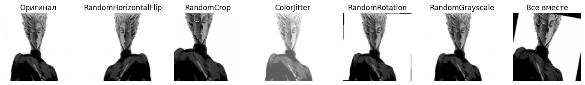
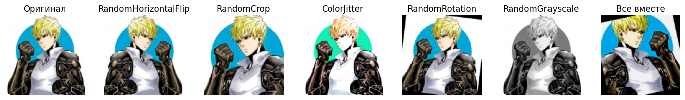
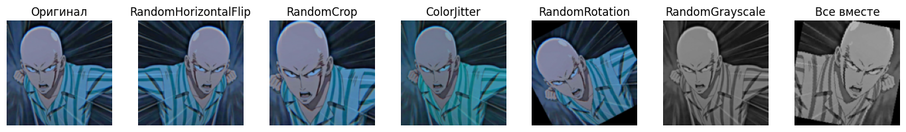
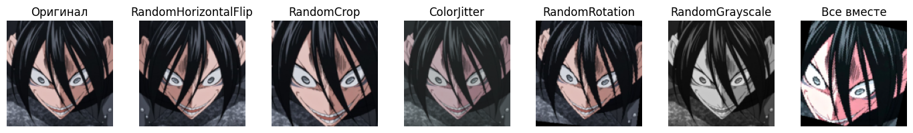
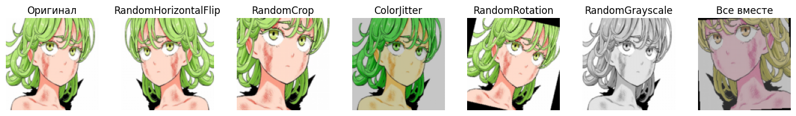
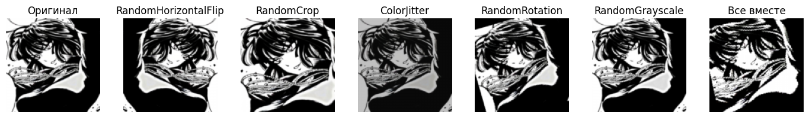

## Задание 1: Стандартные аугментации torchvision (15 баллов)

Результаты аугментации:

---

## Задание 2: Кастомные аугментации (20 баллов)

---

## Задание 3: Анализ датасета (10 баллов)

---

## Задание 4: Pipeline аугментаций (20 баллов)

---

## Задание 5: Эксперимент с размерами (10 баллов)

---

## Задание 6: Дообучение предобученных моделей (25 баллов)

